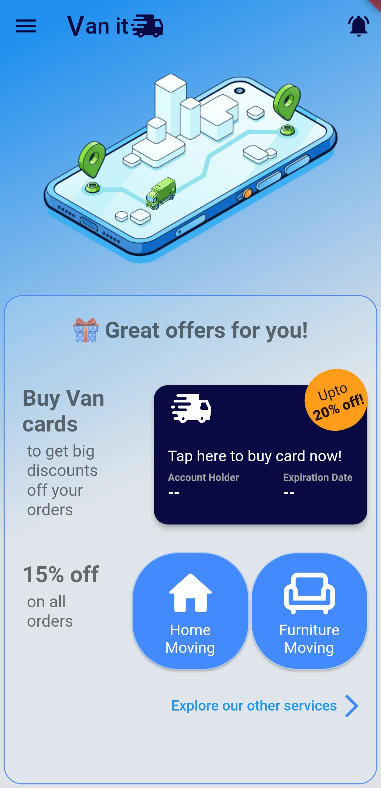
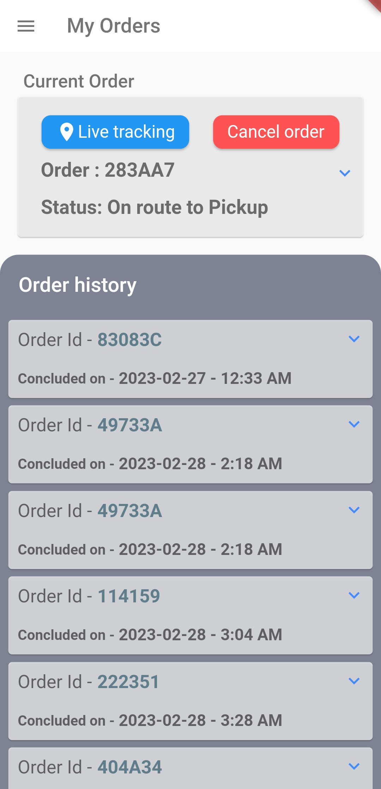
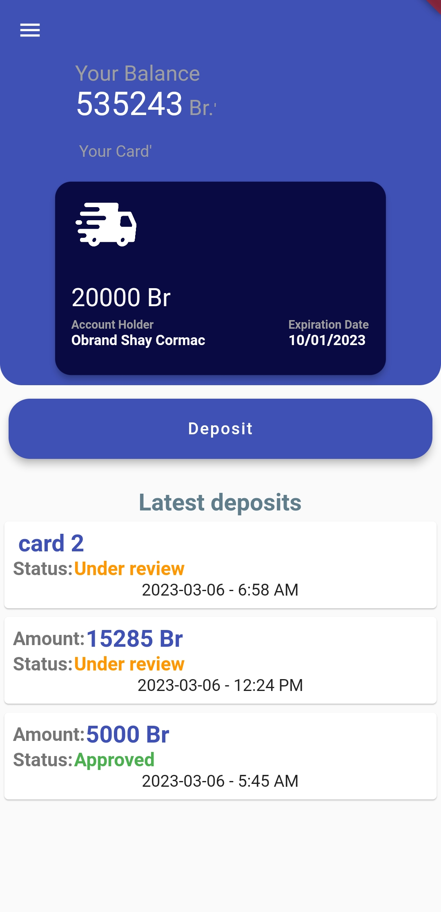
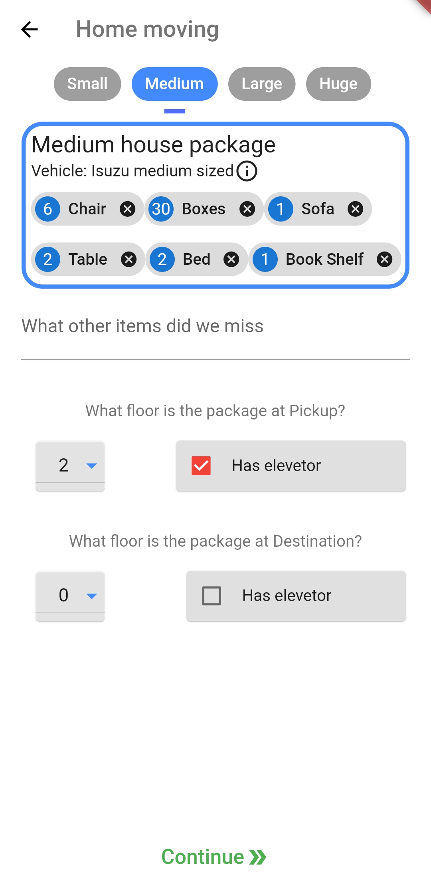
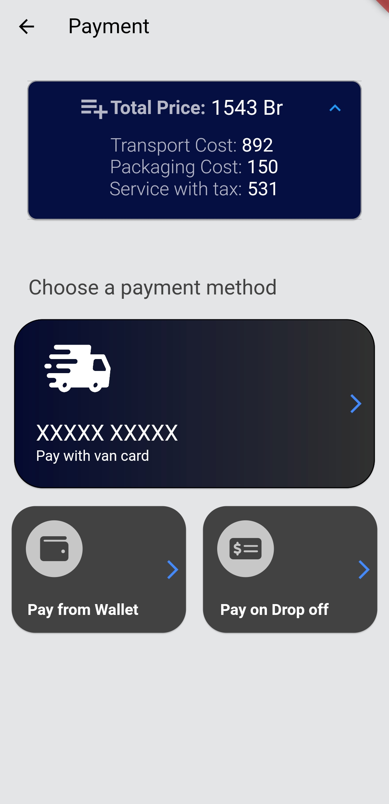
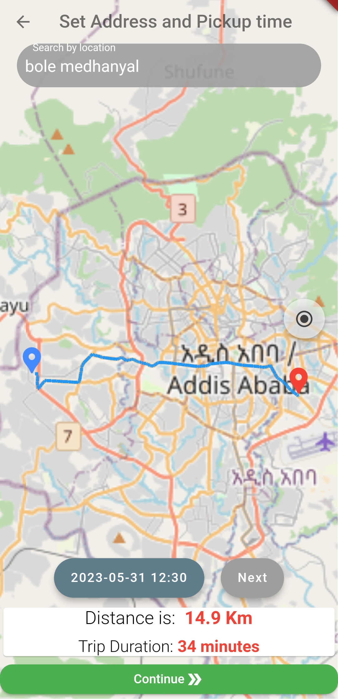
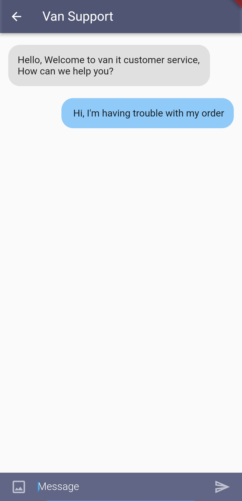

# Van it

Van-It is an innovative client application designed for a comprehensive van lines system that I have developed.
This app offers a range of unparalleled home and other moving services, ensuring a seamless and hassle-free experience for our esteemed customers.

## Table of Contents
* [General Info](#general-information)
* [Technologies Used](#technologies-used)
* [Features](#features)
* [Screenshots](#screenshots)
* [Demo](#demo)
* [Project Status](#project-status)
* [Acknowledgements](#acknowledgements)
* [Contact](#contact)
<!-- * [License](#license) -->

## General Information
- Welcome to a state-of-the-art packers and movers app, designed to offer a wide range of convenient functionalities.
- Our primary goal is to provide an intuitive and user-friendly app that streamlines every aspect of the moving service, all within a single platform.
- Experience a seamless and stress-free moving process as our app takes care of everything, from scheduling to secure payment handling.
- We take pride in highlighting that this app was the culmination of my final year project for my B.Sc in Software Engineering at Mekelle University, reflecting my commitment to excellence in the field.

## Technologies Used
- Flutter 
- Firebase 

## Features
Van-It offers an array of exceptional features, ensuring a seamless moving experience:
- Effortless Ordering: Our app utilizes GPS technology, allowing you to easily place orders based on your location.
- Dedicated Wallet System: Experience the convenience of our specially designed independent wallet system, simplifying payment transactions within the app.
- Real-time Tracking: Stay informed and in control with our live tracking feature, enabling you to monitor the progress of your moving service in real-time.
- Instant Customer Support: Engage in a live chat with our friendly customer support team, who are ready to assist you promptly with any inquiries or concerns you may have.
- Localization for Ethiopian Languages: We take pride in our commitment to inclusivity, offering localization support for three prominent Ethiopian languages, ensuring a seamless experience for users across the country.

## Screenshots

| Home Page              | Orders Page            | Wallet Page            |
| ---------------------- | ---------------------- | ---------------------- | 
|  |  |  |

| Detail form Page       | Payment options Page   | Set address Page       | Support Page           |
| ---------------------- | ---------------------- | ---------------------- | ---------------------- | 
|  |  |  | 

## Demo
A quick walkthrough of how you make an order in the app.   

## Project Status
 There is no active development currently on this project but if anyone is interested to contribute or have any questions about the project, don't hesitate to contact me. 

## Acknowledgements
- This project owes its success to the remarkable OSM Flutter package, available at (https://github.com/liodali/osm_flutter), which played a pivotal role in its implementation.
 A heartfelt appreciation goes to Mohamed Ali Hamza for his exceptional contribution in developing this invaluable package. Be sure to explore his work at (https://github.com/liodali).
- I am immensely grateful to the individuals who extended their support and assistance throughout the development of this project. Your contributions were instrumental in making this venture a reality, and I    extend my sincerest thanks to each and every one of you.

## Contact
Created by [@OBRND](https://github.com/OBRND) - feel free to contact me!  

  
